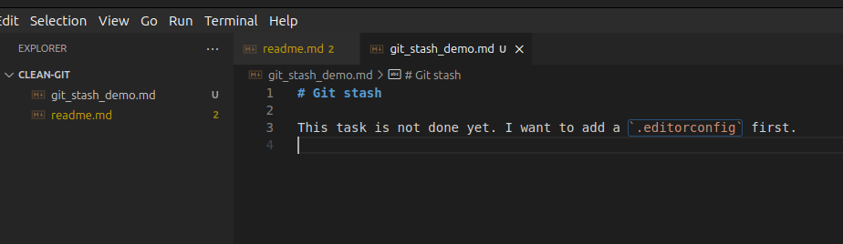
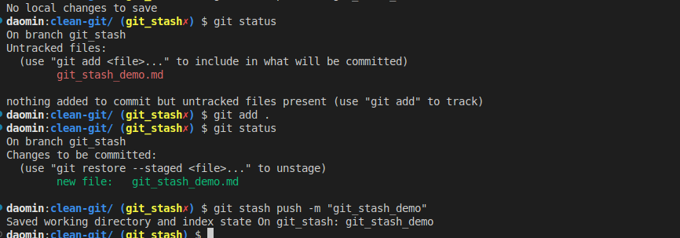
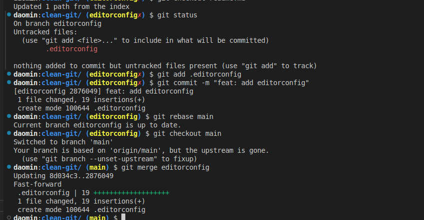
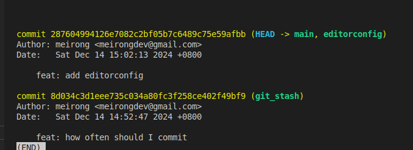
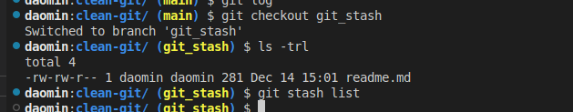
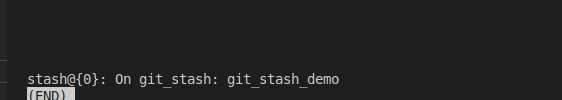
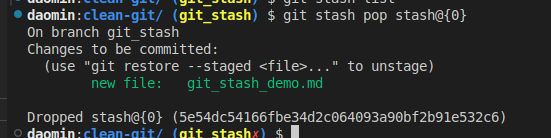
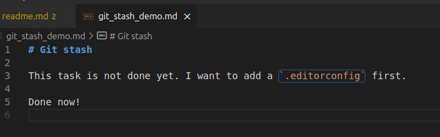
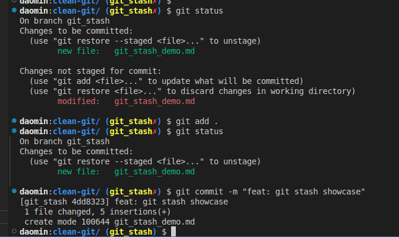

# Git stash

This task is not done yet. I want to add a `.editorconfig` first.

Done now!

## What we have done?

### Create `git_stash` branch and do the task there

### Want to add `.editorconfig` file, then stash the changes

If you just have one `stash record`, can just use `git stash` and `git stash pop` to stash and pop the changes.

### Create `editorconfig` branch and add `.editorconfig` file

After adding the `.editorconfig` file, we can merge the changes to `main` branch.

### After merging the changes of `editorconfig` branch to `main` branch

### Back to `git_stash` branch to continue the task

Use `git stash list` to check the stash records, and use `git stash pop` to pop the changes.

Use `git stash pop` to pop the changes.

Continue the task.

Commit the changes.

