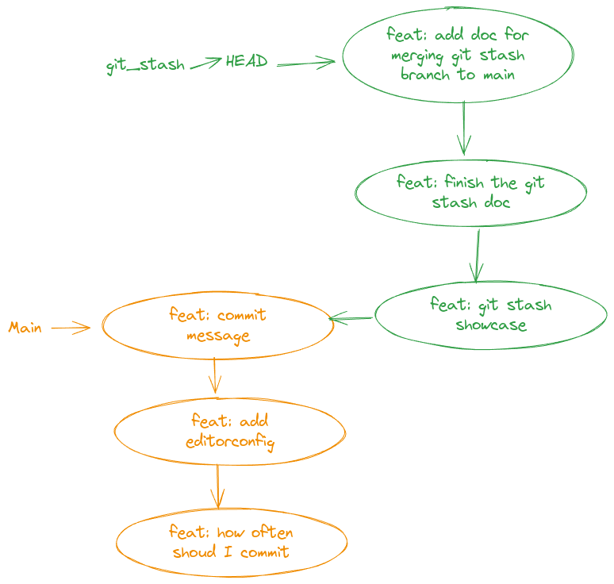
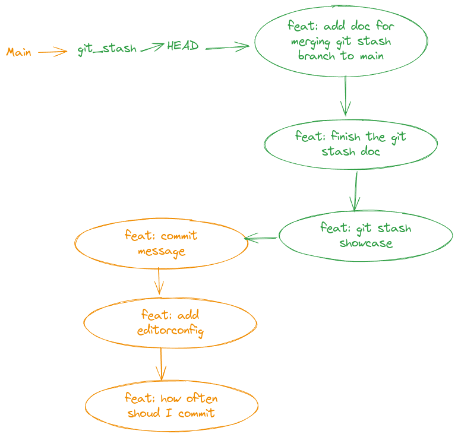
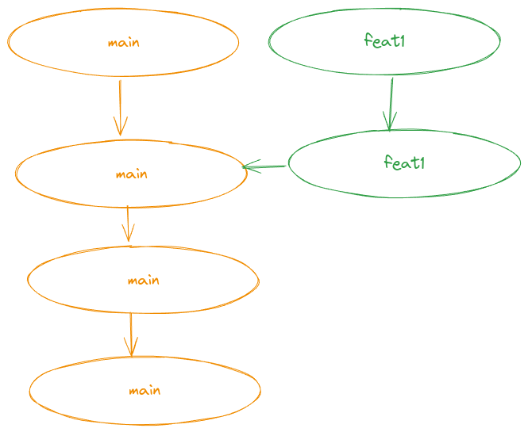
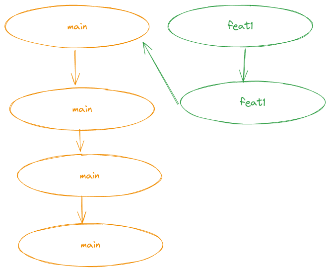
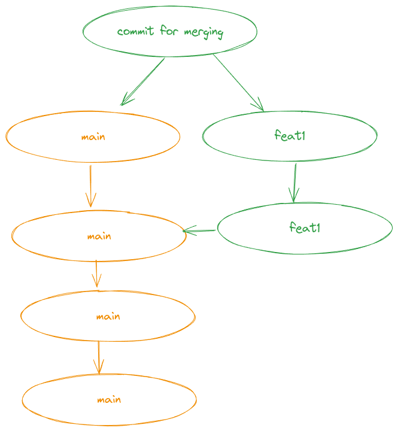

# Clean Git


## Commits – best practices

### How often should I commit?

- A commit should be atomic: exactly one unit of work(one task, one bugfix).
- A big task can be splited into many small tasks.
- If you are in the middle of work and you are called away. Use `git stash`.
  - details can see [git_stash_demo](./git_stash_demo.md)

### Commit message

- Format can refer to [Conventional Commits](https://www.conventionalcommits.org/en/v1.0.0/)
- If one line message is not enough, can use your editor to write a longer message.
  - `git config ––global core editor "code -w"`

## Merge tool

You can use a graphical merge tool to resolve conflicts. I prefer to use `meld`.

- [meld](https://meldmerge.org/)
- `sudo apt-get install meld`

You set up meld as your default merge tool by running the following command:

```bash
git config --global merge.tool meld
```

or you can set up in your `.gitconfig` file:

```bash
git config --edit --global 
```

The content could be like this:

```properties
[user]
	email = meirongdev@gmail.com
	name = meirong
[core]
	editor = code -w
[merge]
	tool = meld # You can change to the path of your merge tool
```

Then you can use `git mergetool` to resolve conflicts.

## Fast forward

When we merge `git_stash` branch to `main` branch, we can see the message `Fast-forward`. 

It means that the `main` branch is updated to the latest commit of `git_stash` branch.

Before merge

After merge


## Rebase vs Merge

When we `checkout` a new branch from `main` branch, we can use `rebase` or `merge` to merge the branch back to `main` branch.



If we use `rebase`, the commit history will be linear(can refer to how we merge `git_stash` branch to `main`). 



If we use `merge` without `rebase`, we will add a new commit to the commit history.



- It will find the common ancestor of the two branches
- It will compare the changes between the common ancestor and the two branches, then create a new commit to merge the changes.

## Avoiding merge conflicts

- Do not have more than one person working on the same file at the same time if possible.
- Merge `main`(or other branches your branch is based on) to your branch before you merge your branch back frequently.

> **Note**:  Do not merge your branch to the `main` branch. But merge `main` branch to your branch. It will help you to find conflicts earlier and resolve them as soon as possible, then you can move on to your work.

> **Note**:  Do not rebase the branch that is shared with others.
